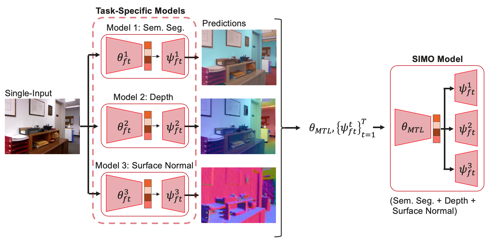

<<<<<<< Updated upstream
# Single-Input Multiple-Output Model Merging: Leveraging Foundation Models for Multi-Task Learning 
TODO


## Benchmark
For standard 3 tasks in NYUv2 (without noise prediction task) in the multi-task learning setting with Split architecture, please follow the results below.
=======
# [Single-Input Multiple-Output Model Merging: Leveraging Foundation Models for Multi-Task Learning](https://arxiv.org/abs/2504.11268)
Model merging is a flexible and computationally tractable approach to merge single-task checkpoints into a multi-task model. Prior work has solely focused on constrained multi-task settings where there is a one-to-one mapping between a sample and a task, overlooking the paradigm where multiple tasks may operate on the same sample, e.g., scene understanding. In this paper, we focus on the multi-task setting with single-input-multiple-outputs (SIMO) and show that it qualitatively differs from the single-input-single-output model merging settings studied in the literature due to the existence of task-specific decoders and diverse loss objectives. We identify that existing model merging methods lead to significant performance degradation, primarily due to representation misalignment between the merged encoder and task-specific decoders. We propose two simple and efficient fixes for the SIMO setting to re-align the feature representation after merging. Compared to joint fine-tuning, our approach is computationally effective and flexible, and sheds light into identifying task relationships in an offline manner. Experiments on NYUv2, Cityscapes, and a subset of the Taskonomy dataset demonstrate: 

1. Task arithmetic suffices to enable multi-task capabilities; however, the representations generated by the merged encoder has to be re-aligned with the task-specific heads; 

2. The proposed architecture rivals traditional multi-task learning in performance but requires fewer samples and training steps by leveraging the existence of task-specific models.





## File Structure
The repository is organized as follows:
- ```config/```: Contains all configuration files in YAML format, including training and model merging parameters. These configurations are utilized by the notebooks and scripts.
- ```model_merging/```: Implements the logic to extract and aggregate task vectors using techniques specified in the configuration files.
- ```models/```: Stores the DINOv2 logic, copied from the [official DINOv2 repository](https://github.com/facebookresearch/dinov2).
- ```training/```: Contains the logic for creating dataset objects and utility functions to facilitate training processes.
- ```notebooks/```: Includes experimental logic and visualization code for analysis and exploration.
>>>>>>> Stashed changes


### NYUv2 Dataset
| Method                 | Sem. Seg. (mIOU) | Depth (aErr.) | Normal (mDist.) | Delta MTL | TV Norm |
|------------------------|------------------|---------------|-----------------|-----------|------|
| **MTL (Equal)** | 47.70 | 46.34 | - | - | - |
| **TS FFT** | 49.91 | 57.70 | - | -  | - |
| **Sum-TA FFT ($\alpha=0.5$)** | 20.04 | 105.20 | - | - | 1487 |
| **TS P+FFT** | 52.06 | 46.88 | -   | - | - |
| **Sum-TA P ($\alpha=0.5$)** | 35.53 | 59.71 | -   | - | 440 |
| **Sum-TA P+FFT ($\alpha=0.5$)** | 50.23 | 49.65 | -   | - | 628 |


### DINOv2-base (linear head) - NYUv2 Dataset
| Method                 | Sem. Seg. (mIOU) | Depth (aErr.) | Normal (mDist.) | Delta MTL | TV Norm |
|------------------------|------------------|---------------|-----------------|-----------|------|
| **MTL (Equal)** | - | - | - | - | - |
| **TS LP** | 67.32 | 45.66 | -   | - | - |
| **Sum-TA LP ($\alpha=0.5$)** | - | - | -   | - | - |
| **Sum-TA LP + FFT ($\alpha=0.5$)** | 63.91 | 42.41 | -   | - | - |

- **MTL**: Multi-Task Learning
- **TS**: Task-Specific
- **TA**: Task Arithmetic
- **TV**: Task Vector
- **FFT**: Full Fine-Tuning
- **P**: Probing